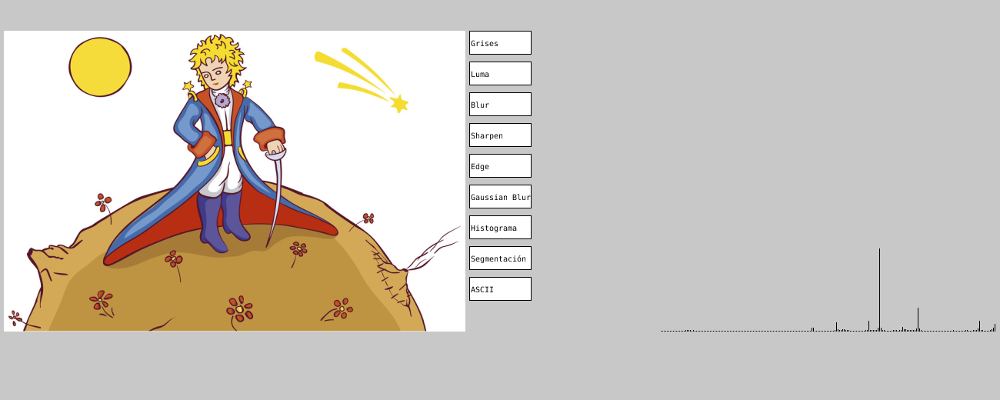

| Nombres        | Apellidos          | Usuario |
|:-------------|:------------------|:------|
| Adriana           | Dorado Soler | gadrielag  |
| Pedro Alexander | Higuera   | pahigueraf  |

# Objetivo

Realizar el [taller de procesamiento de imágenes](https://visualcomputing.github.io/collaborations.html). propuesto por el profesor Jean Pierre Charalambos en el curso de Computación Visual en el primer semestre del 2020. 

# Motivación

Conocer e implementar diferentes operaciones para el análisis de imágenes y vídeos y así entender su funcionamiento para futuros proyectos. Además, se desea identificar la diferencia entre las implementaciones hechas por software y hardware.

# Actividades

El taller detalla las siguientes actividades a implementar. En nuestro repositorio se puede observar las siguientes carpetas:

*   taller_imagen_software: Implementaciones por software de todas las operaciones y actividades relacionadas con imágenes.
*   taller_imagen_hardware: Implementaciones por hardware de todas las operaciones y actividades relacionadas con imágenes.
*   taller_video_software: Implementaciones por software de todas las operaciones y actividades relacionadas con vídeos.
*   taller_video_hardware: Implementaciones por hardware de todas las operaciones y actividades relacionadas con vídeos.

Por cada carpeta se encuentra el código fuente y los recursos implementados. Al ejecutar el programa de cada carpeta se muestra una ventana con el recurso cargado y las diferentes operaciones que se pueden realizar.

A continuación, se describen las actividades propuestas dividiendo cada una en su implementación tanto en software como en vídeo. Además, al final de cada actividad se podrán observar los resultados tanto en vídeo como en imagen.

## 1. Conversión a escala de grises: promedio RGB y luma

### Software

Para realizar la conversión a escala de grises, tanto de imagen como de vídeo(secuencia de imágenes ) es preciso considerar los valores RGB para cada píxel y hacer que el pixel retornado sea un valor único que refleje el brillo de ese píxel. Los enfoques que implementamos son: 

1. Promedio RGB: Tomar el promedio de la cada componente del pixel: (R + B + G) / 3.
2. Luma: Multiplicar cada componente del pixel por un factor, en este caso **0.299*R + 0.587*G + 0.114B**

```java
void escala_grises(PImage img) {  
  for(int i=0; i<img.width; i++){
    for(int j=0; j<img.height; j++){
      color c = img.get(i,j);
      c = color(Math.round((red(c) + green(c) + blue(c))/3));
      img.set(i,j,c);      
    }
  }
}

void luma(PImage img) {  
  for(int i=0; i<img.width; i++){
    for(int j=0; j<img.height; j++){
      color c = img.get(i,j);
      c = color(Math.round((0.299*red(c) + 0.587*green(c) + 0.114*blue(c))));
      img.set(i,j,c);      
    }
  }
}
```

### Hardware: 

Se crea un shader (imagen inferior) y se aplica a cada gráfico creado en el código de processing.

```java
// Para promedio RGB 
const vec4 lumcoeff = vec4(0.333, 0.333, 0.333, 0);
// Para promedio luma
const vec4 lumcoeff = vec4(0.299, 0.587, 0.114, 0);

void main() {
  vec4 col = texture2D(texture, vertTexCoord.st);
  float lum = dot(col, lumcoeff);
  gl_FragColor = vec4(lum, lum, lum, 1.0) * vertColor;  
}

```

#### Resultados

* RGB


* Luma


## 2. Máscaras de convolución

Por cada pixel de la imagen se aplica la matriz de convolución respectiva para obtener el filtro o máscara deseado. Las operaciones que realizamos fueron:

1. Box Blur
2. Sharpen
3. Edge detection
4. GaussianBlur

### Software
```java

void convolucion(float[][] kernel, PImage original, PImage destino, int tamanio_kernel){
  original.loadPixels();
  destino.loadPixels();
  for (int x = 0; x < original.width; x++) {
    for (int y = 0; y < destino.height; y++ ) {
      color c = aplicar_kernel(x,y,kernel, tamanio_kernel,img);
      int loc = x + y*img.width;
      destino.pixels[loc] = c;
    }
  }
  destino.updatePixels();
}
```

### Hardware

Se crea un shader (imagen inferior) y se aplica a cada gráfico creado en el código de processing.

```java
void main() {
  //create matrix positions
  vec2 tc0 = vertTexCoord.st + vec2(-texOffset.s, -texOffset.t);
  vec2 tc1 = vertTexCoord.st + vec2(         0.0, -texOffset.t);
  vec2 tc2 = vertTexCoord.st + vec2(+texOffset.s, -texOffset.t);
  vec2 tc3 = vertTexCoord.st + vec2(-texOffset.s,          0.0);
  vec2 tc4 = vertTexCoord.st + vec2(         0.0,          0.0);
  vec2 tc5 = vertTexCoord.st + vec2(+texOffset.s,          0.0);
  vec2 tc6 = vertTexCoord.st + vec2(-texOffset.s, +texOffset.t);
  vec2 tc7 = vertTexCoord.st + vec2(         0.0, +texOffset.t);
  vec2 tc8 = vertTexCoord.st + vec2(+texOffset.s, +texOffset.t);

  vec4 col0 = texture2D(texture, tc0);
  vec4 col1 = texture2D(texture, tc1);
  vec4 col2 = texture2D(texture, tc2);
  vec4 col3 = texture2D(texture, tc3);
  vec4 col4 = texture2D(texture, tc4);
  vec4 col5 = texture2D(texture, tc5);
  vec4 col6 = texture2D(texture, tc6);
  vec4 col7 = texture2D(texture, tc7);
  vec4 col8 = texture2D(texture, tc8);

  vec4 sum =  col0*kernel[0] + col1*kernel[1] + col2*kernel[2]
            + col3*kernel[3] + col4*kernel[4] + col5*kernel[5]
            + col6*kernel[6] + col7*kernel[7] + col8*kernel[8];
  gl_FragColor = vec4(sum.rgb, 1.0) * vertColor;
}
```

#### Resultados

* Blur


* Sharpen


* Edge


* Gaussian


## 3. Conversión a ASCII

### Software

Teniendo en cuenta un arreglo de símbolos como parametro se recorre una imagen pixel a pixel y se obtiene su color para darle un brillo a cada pixel con el nuevo carácter asociado del arreglo de símbolos definido.

```java
void convertir_ascii(PImage img) { 
    img.filter(GRAY);
    img.loadPixels();
    for (int y = 0; y < img.height; y += resolution) {
        for (int x = 0; x < img.width; x += resolution) {
        color pixel = img.pixels[y * img.width + x];
        text(ascii[int(brightness(pixel))], x + ancho + 95, y+46);
        }
    };
}
```

#### Resultados


## 4. Despliegue del histograma

### Software

```java
int [] histogram(PImage img){
  int[] hist = new int[256];
  for (int i = 0; i < img.width; i++) {
    for (int j = 0; j < img.height; j++) {
      int bright = int(brightness(img.get(i, j)));
      hist[bright]++; 
    }
  }
  return hist;
}

```

#### Resultados



## 5. Eficiencia computacional

#### Resultados

Se comparan resultados empleando software y hardware para la máscara de convolución de Edge. Las diferencias se pueden ver en la siguiente imagen:


# Conclusiones

*   Se puede evidenciar un mejor rendimiento en las implementaciones realizadas por hardware, lo que podría representar una mejor experiencia de usuario en aplicaciones que procesen mucha información.
*   Implementar processing para el análisis de vídeos es muy similar a las implementaciones realizadas por imágenes ya que de la configuración realizada para imágenes se utilizó también para videos. Por tal razón, processing es muy útil para realizar estos análisis.
*   Realizar la conversión de processing a p5.js, para mostrar en la página el programa en ejecución, fue un tiempo improductivo ya que requería de ciertos conocimientos que aún no conocemos y por tal razón decidimos no implementarlo.

